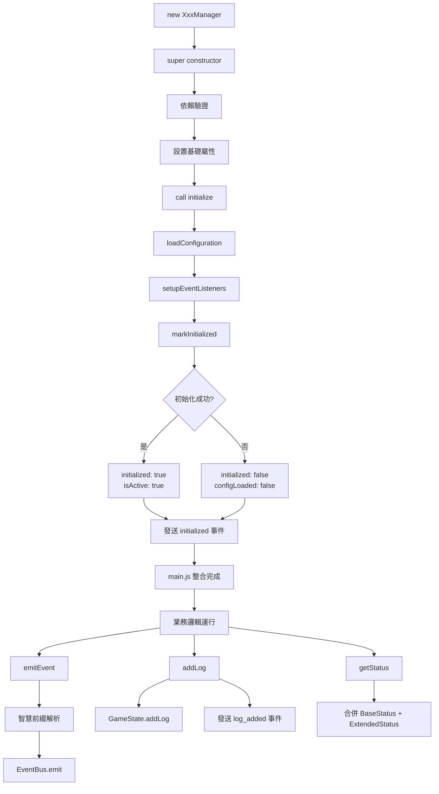
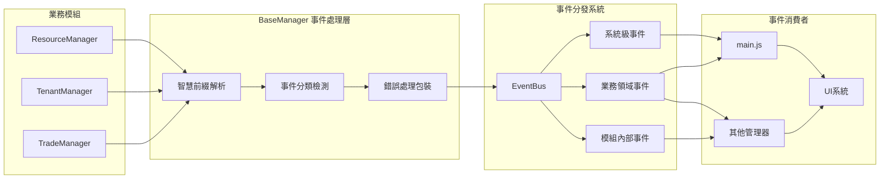

# BaseManager v2.0 開發指南

## 🎯 核心概念

BaseManager v2.0 是末日房東模擬器的統一業務管理器基礎架構，解決原有系統重複代碼和事件命名不一致問題。

### 解決的核心問題
- **重複功能實作**：統一事件、日誌、狀態管理
- **事件命名衝突**：混合分層前綴策略
- **main.js 整合複雜度**：標準化管理器介面

## 🏗️ 混合分層前綴策略

BaseManager 自動根據事件性質決定命名規則：

```javascript
// 1. 系統級事件（SYSTEM_PREFIXES: ['system_', 'game_', 'day_']）
'system_ready' → 'system_ready'        // 保持原名，跨所有模組
'day_advanced' → 'day_advanced'        // 保持原名，遊戲循環

// 2. 業務領域事件（BUSINESS_PREFIXES: ['harvest_', 'scavenge_']）  
'harvest_completed' → 'harvest_completed'   // 保持原名，跨模組業務
'scavenge_failed' → 'scavenge_failed'       // 保持原名，跨模組業務

// 3. 模組內部事件（自動添加模組前綴）
'threshold_warning' → 'resource_threshold_warning'  // ResourceManager
'tenantHired' → 'tenant_tenantHired'                // TenantManager
'tradeCompleted' → 'trade_tradeCompleted'           // TradeManager
```

### 智慧前綴解析演算法

```javascript
_resolveEventName(eventName) {
  // 1. 檢查系統級前綴 → 直接使用
  if (SYSTEM_PREFIXES.some(prefix => eventName.startsWith(prefix))) {
    return eventName;
  }
  
  // 2. 檢查業務領域前綴 → 直接使用
  if (BUSINESS_PREFIXES.some(prefix => eventName.startsWith(prefix))) {
    return eventName;
  }
  
  // 3. 檢查已有模組前綴 → 避免重複
  if (MODULE_PREFIXES.some(prefix => eventName.startsWith(prefix))) {
    return eventName;
  }
  
  // 4. 其他情況 → 添加模組前綴
  return `${this.getModulePrefix()}_${eventName}`;
}
```

## 💼 使用方式

### 基本繼承模式

```javascript
import BaseManager from '../utils/BaseManager.js';

class ResourceManager extends BaseManager {
  constructor(gameState, eventBus) {
    super(gameState, eventBus, 'ResourceManager');
  }
  
  // 必須實作：定義模組前綴
  getModulePrefix() {
    return 'resource';
  }
  
  // 必須實作：設置事件監聽器
  setupEventListeners() {
    this.onEvent('game_state_changed', (eventObj) => {
      this.handleStateChange(eventObj.data);
    });
  }
  
  // 可選實作：擴展狀態資訊
  getExtendedStatus() {
    return {
      totalResources: this.calculateTotalResources(),
      warningThresholds: this.getWarningThresholds()
    };
  }
}
```

### 統一介面使用

```javascript
// 統一事件發送（自動前綴解析）
this.emitEvent('modified', { type, amount }); 
// → 實際發送: 'resource_modified'

// 跨模組業務事件（保持原名）
this.emitEvent('harvest_completed', { amount });
// → 實際發送: 'harvest_completed'

// 統一日誌記錄
this.logSuccess('操作成功完成');
this.logError('操作執行失敗', error);

// 統一初始化流程
async initialize() {
  try {
    await this.loadConfiguration();
    this.setupEventListeners();
    this.markInitialized(true);
  } catch (error) {
    this.logError('初始化失敗', error);
    this.markInitialized(false);
  }
}
```

## 🔄 系統整合流程

### BaseManager 生命週期



### 事件流動架構



## 🎯 事件命名規範

### 統一化命名範例

| 事件類型 | 舊命名 | 新命名 | 分類 |
|---------|-------|--------|------|
| 院子採集 | `harvest_completed` | `harvest_completed` | 業務領域 |
| 搜刮開始 | `tenant_scavengeStarted` | `scavenge_started` | 業務領域 |
| 資源修改 | `threshold_warning` | `resource_threshold_warning` | 模組專屬 |
| 租客雇用 | `tenantHired` | `tenant_tenantHired` | 模組專屬 |
| 系統就緒 | `system_ready` | `system_ready` | 系統級 |

### 命名最佳實踐

1. **跨模組業務事件**：使用業務領域前綴（harvest_, scavenge_）
2. **模組內部事件**：讓 BaseManager 自動添加模組前綴
3. **系統級事件**：使用系統前綴（system_, game_, day_）

## 🔧 main.js 整合

### 標準初始化模式

```javascript
async _initializeBusinessModules() {
  // 所有管理器都遵循相同模式
  this.resourceManager = new ResourceManager(this.gameState, this.eventBus);
  await this.resourceManager.initialize();
  
  this.tenantManager = new TenantManager(this.gameState, this.eventBus);  
  await this.tenantManager.initialize();
  
  // 統一狀態檢查
  const allInitialized = [
    this.resourceManager,
    this.tenantManager,
    this.tradeManager
  ].every(manager => manager.getStatus().initialized);
}
```

### 統一狀態介面

```javascript
// 所有管理器提供一致的狀態格式
manager.getStatus() => {
  initialized: boolean,     // main.js 標準屬性
  isActive: boolean,        // main.js 標準屬性
  configLoaded: boolean,    // main.js 標準屬性
  managerType: string,      // BaseManager 基礎屬性
  version: string,          // BaseManager 基礎屬性
  ...extendedStatus         // 各管理器專屬屬性
}
```

## 💡 開發最佳實踐

### 錯誤處理策略

```javascript
async performCriticalOperation() {
  try {
    const result = await this.executeBusiness();
    this.logSuccess('操作成功完成');
    return result;
  } catch (error) {
    this.logError('操作執行失敗', error);
    throw error; // 向上傳播
  }
}
```

### 狀態擴展模式

```javascript
getExtendedStatus() {
  return {
    // 業務統計
    operationCount: this.operationCount,
    
    // 效能資訊
    lastOperationTime: this.lastOperationTime,
    
    // 配置狀態
    configurationValid: this.validateConfiguration()
  };
}
```

### 除錯工具

```javascript
// 開發模式除錯
if (this.isDebugMode()) {
  this.debugEventNaming();  // 顯示事件前綴解析示例
  this.getInfo();           // 完整管理器資訊
