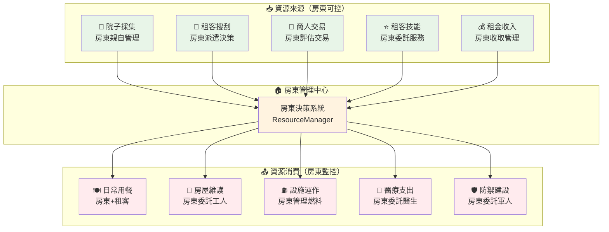
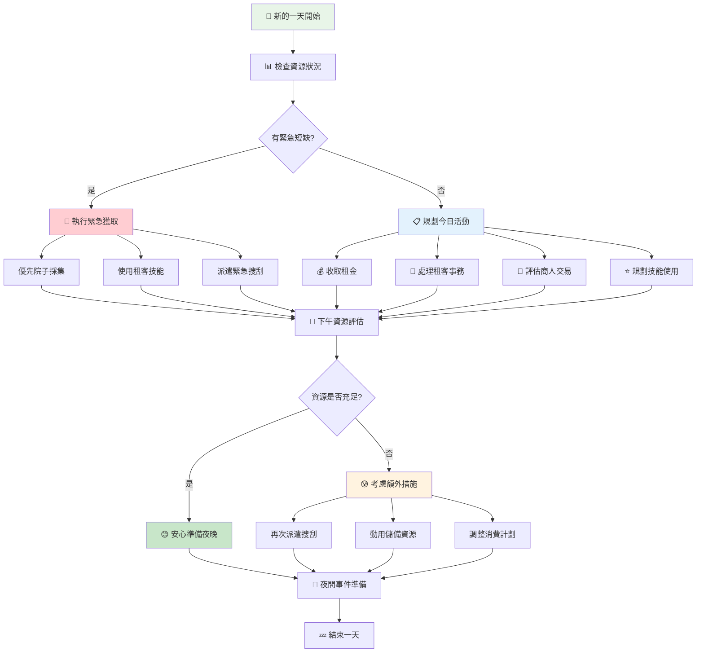
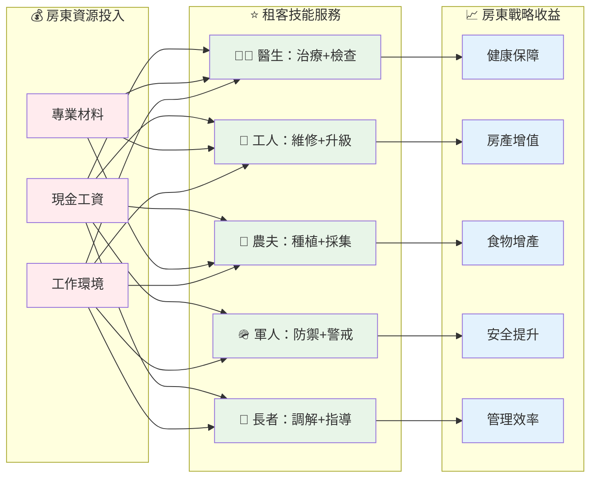
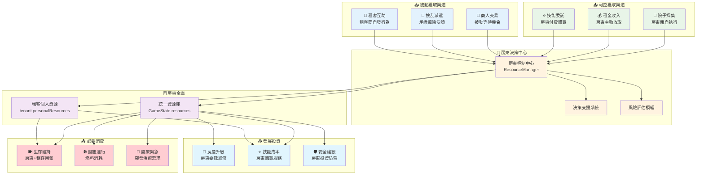

# ResourceManager 架構設計文檔

## 📊 文檔概覽

本文檔深入解析ResourceManager的架構設計理念、業務邏輯與系統整體規劃。作為末日房東模擬器資源流轉控制的核心模組，ResourceManager承載著房東經營策略的基礎架構職責。

**文檔用途**：系統架構理解、設計理念傳承、業務邏輯規劃  
**目標讀者**：系統設計者、核心開發者、遊戲性規劃者  
**遊戲定位**：末日房東模擬器 - 小型單人經營遊戲  

---

## 🎯 模組定位與職責邊界

### 遊戲世界觀下的角色定位

ResourceManager在末日房東模擬器中扮演**房東資源決策支援系統**的角色，其設計哲學基於房東的生存策略：

#### **房東生存法則：堅守陣地策略**
```
房東本體 → 不外出冒險 → 透過管理獲得資源 → 維持房產運作
```
- **核心理念**：房東作為管理者，不親自外出冒險
- **生存策略**：透過智慧管理租客與房產獲得資源
- **風險控制**：避免房東直接面對外界危險

#### **資源獲取的房東視角**
```
房東決策 → 租客執行 → 資源回流 → 房產強化 → 吸引更多租客
```
- **院子採集**：房東親自管理的安全資源來源
- **租客搜刮**：派遣租客外出，房東承擔決策風險
- **商人交易**：被動等待商機，房東評估交易價值
- **租客技能**：透過提供資源，換取租客專業服務

#### **資源管理的戰略思維**
```
短期生存 → 中期穩定 → 長期發展 → 社區領導
```
- **短期**：確保房東與租客基本生存需求
- **中期**：建立穩定的資源獲取與消費循環
- **長期**：打造具有競爭力的住宿環境
- **終極**：成為區域內最安全可靠的避難所

### 業務邊界與職責劃分

| 職責類別 | ResourceManager負責 | 其他模組負責 |
|---------|-------------------|-------------|
| **資源狀態追蹤** | ✅ 統一記錄、監控、警示 | ❌ 直接修改資源數值 |
| **獲取策略制定** | ❌ 具體業務決策 | ✅ 基於房東策略調用API |
| **消費控制** | ✅ 驗證、限制、記錄 | ✅ 提出消費需求 |
| **風險評估** | ✅ 資源稀缺性分析 | ✅ 基於風險調整策略 |
| **交易執行** | ✅ 資源轉移機制 | ✅ 交易邏輯與談判 |

---

## 🏗️ 核心架構設計理念

### 房東中心化資源管理

#### 設計原則：房東視角的資源控制

**核心問題**：如何讓房東在不外出的情況下有效管理所有資源流動？

**解決方案**：建立房東中心化的資源決策與監控體系



#### 房東決策支援系統

**決策支援原則**：為房東提供充分資訊，支援策略制定
```javascript
// 房東視角的資源狀態評估
getResourceStatusForLandlord(resourceType) {
    return {
        currentValue: 當前庫存,
        consumptionRate: 每日消耗率,
        daysRemaining: 預估剩餘天數,
        acquisitionOptions: 可獲取方式,
        riskLevel: 風險等級,
        recommendations: 房東行動建議
    };
}

// 房東決策建議範例
recommendations: [
    "派遣工人租客搜刮建材",
    "使用醫生技能生產醫療用品", 
    "考慮與下次商人交易",
    "院子採集冷卻還剩1天"
]
```

### 被動獲取優先架構

#### 設計理念：最小化房東風險暴露

**優先順序設計**：
1. **零風險來源**：院子採集（房東親自，無外界風險）
2. **低風險來源**：租客技能（消耗資源，獲得服務）
3. **中風險來源**：商人交易（被動等待，評估價值）
4. **高風險來源**：租客搜刮（派遣他人，承擔損失風險）

```javascript
// 資源獲取優先級評估
assessAcquisitionPriority(resourceType, urgency) {
    const options = [];
    
    // 優先級1：零風險方案
    if (canHarvestYard() && resourceType === 'food') {
        options.push({
            method: '院子採集',
            risk: 'zero',
            cost: '時間冷卻',
            availability: 'immediate'
        });
    }
    
    // 優先級2：低風險方案
    const skillOptions = getAvailableSkillsFor(resourceType);
    skillOptions.forEach(skill => {
        options.push({
            method: `${skill.tenantType}技能`,
            risk: 'low',
            cost: skill.resourceCost,
            availability: skill.cooldownStatus
        });
    });
    
    // 優先級3：中風險方案
    if (merchantAvailable()) {
        options.push({
            method: '商人交易',
            risk: 'medium',
            cost: '交易成本+議價風險',
            availability: 'random'
        });
    }
    
    // 優先級4：高風險方案
    const tenants = getAvailableTenants();
    tenants.forEach(tenant => {
        options.push({
            method: `派遣${tenant.name}搜刮`,
            risk: 'high',
            cost: '租客安全風險',
            availability: 'immediate'
        });
    });
    
    return options.sort((a, b) => this.riskWeight[a.risk] - this.riskWeight[b.risk]);
}
```

### 資源稀缺性管理哲學

#### 末日世界的資源現實

**基本假設**：在末日世界中，所有資源都是稀缺的
- **食物**：最關鍵的生存資源，需要持續獲取
- **醫療**：無法自然恢復，依賴專業知識
- **建材**：房屋安全的基礎，關係所有人生存
- **燃料**：現代設施運作必需，逐漸枯竭
- **現金**：交易媒介，在末日世界仍有限價值

```javascript
// 末日世界的資源稀缺性模型
const SCARCITY_MODEL = {
    food: {
        scarcityFactor: 'high',
        renewability: 'partial',        // 院子採集可再生
        alternatives: ['院子採集', '搜刮', '農夫技能'],
        criticalThreshold: 2           // 2天存糧觸發危機
    },
    medical: {
        scarcityFactor: 'extreme',
        renewability: 'none',          // 無自然再生
        alternatives: ['搜刮', '醫生技能', '商人交易'],
        criticalThreshold: 0           // 無庫存即危機
    },
    materials: {
        scarcityFactor: 'medium',
        renewability: 'none',
        alternatives: ['搜刮', '拆解舊物'],
        criticalThreshold: 1           // 至少保留1個維修用
    }
};
```

---

## 🔄 核心業務流程設計

### 房東日常資源管理週期

#### 每日資源決策流程



### 院子採集的戰略價值

#### 為什麼院子採集是房東的核心資源策略？

**戰略意義分析**：
1. **零風險性**：房東不需外出，無安全威脅
2. **可控性**：時間、方式完全由房東決定
3. **可預測性**：產量穩定，可納入長期規劃
4. **可擴展性**：透過農夫租客技能提升效率

```javascript
// 院子採集的房東價值模型
const YARD_HARVEST_VALUE = {
    strategicBenefits: {
        riskLevel: 'zero',              // 無風險
        landlordControl: 'complete',     // 完全控制
        predictability: 'high',         // 高可預測性
        scalability: 'moderate'         // 中等可擴展性
    },
    
    operationalBenefits: {
        immediateAvailability: true,     // 立即可用
        noResourceCost: true,           // 無資源成本
        weatherIndependent: true,       // 不受外界影響
        repeatable: true                // 可重複執行
    },
    
    strategicLimitations: {
        singleResourceType: 'food',     // 僅產出食物
        cooldownPeriod: 2,              // 冷卻期限制
        baseAmountFixed: 2,             // 基礎產量固定
        requiresLandlordAction: true    // 需要房東親自行動
    }
};
```

### 租客技能的房東管理策略

#### 房東如何透過資源獲得租客專業服務

**管理哲學**：房東提供資源，租客提供專業技能，互利共生



---

## 🎯 資源流轉控制架構

### 房東視角的資源流動模型

#### 以房東決策為核心的流動控制



### 三級預警系統的房東應用

#### 為房東提供分級風險管理

**預警哲學**：給房東充分的反應時間，避免資源危機

| 預警等級 | 房東反應時間 | 建議行動 | 行動緊迫性 |
|---------|------------|----------|-----------|
| **🟡 警告** | 3-5天準備期 | 規劃資源獲取活動 | 從容計劃 |
| **🟠 危急** | 1-2天反應期 | 立即執行獲取行動 | 緊急應對 |
| **🔴 緊急** | 當日必須處理 | 動用所有可用資源 | 生存危機 |

```javascript
// 房東預警決策支援
generateLandlordAlert(resourceType, level, daysRemaining) {
    const alertConfig = {
        warning: {
            urgency: 'low',
            timeframe: '未來3-5天',
            actions: [
                '檢查院子採集冷卻狀態',
                '評估租客技能使用成本',
                '留意商人交易機會',
                '考慮派遣租客搜刮'
            ],
            tone: '建議性規劃'
        },
        critical: {
            urgency: 'high', 
            timeframe: '1-2天內',
            actions: [
                '立即執行院子採集（如果可用）',
                '使用租客技能生產資源',
                '派遣最適合的租客搜刮',
                '動用租客個人資源'
            ],
            tone: '緊急行動指示'
        },
        emergency: {
            urgency: 'critical',
            timeframe: '今日內',
            actions: [
                '動用所有可用獲取方式',
                '考慮犧牲其他資源交換',
                '緊急調整消費計劃',
                '啟動生存模式'
            ],
            tone: '生存危機警告'
        }
    };
    
    return {
        message: `${resourceType}預警：${alertConfig[level].timeframe}內需要補充`,
        recommendations: alertConfig[level].actions,
        urgency: alertConfig[level].urgency
    };
}
```

---

## 📈 架構演進規劃

### 短期優化：深化房東管理體驗（v2.1）

#### 1. **房東決策支援強化**
- **資源預測系統**：基於當前消費模式預測未來3-7天資源需求
- **行動建議引擎**：為房東提供個人化的資源獲取建議
- **風險評估面板**：量化不同獲取方式的風險與收益

#### 2. **院子管理深化**
- **季節性變化**：不同季節影響院子採集效率與產量
- **土壤品質系統**：持續使用提升土壤，連續採集可能降低產量
- **作物多樣性**：擴展院子可產出的資源類型（香料、藥草等）

#### 3. **租客技能體系完善**
- **技能冷卻視覺化**：房東清楚掌握每個租客的技能可用狀態
- **技能組合效果**：多個租客協作產生的額外效益
- **技能升級機制**：長期雇用的租客技能熟練度提升

### 中期擴展：房產經營深度（v3.0）

#### 1. **房東專業化發展**
- **管理技能樹**：房東透過經驗積累解鎖高級管理能力
- **聲譽系統**：成功經營提升房東在倖存者中的聲譽
- **經營策略分支**：安全導向vs效率導向vs社交導向的不同發展路線

#### 2. **房產價值提升系統**
- **房間專業化**：醫療室、工作坊、儲藏室等功能性房間
- **設施升級鏈**：從基礎避難所到舒適住宅的漸進式改善
- **環境舒適度**：影響租客滿意度和工作效率的環境因素

#### 3. **社區互動網絡**
- **鄰近倖存者**：與附近其他倖存者建立貿易關係
- **情報網絡**：透過租客獲得外界資訊，輔助決策
- **聯盟合作**：與其他房東形成資源互助聯盟

### 長期願景：區域領導地位（v4.0+）

#### 1. **倖存者社區中心**
- **避難所網絡**：成為區域內倖存者的集散中心
- **資源調配中心**：協調多個小型倖存者團體的資源分配
- **知識保存者**：收集並保存末日前的重要知識與技術

#### 2. **可持續發展系統**
- **生態循環**：建立食物-廢料-肥料的閉環系統
- **能源自給**：太陽能、風能等可再生能源利用
- **技術恢復**：逐步恢復末日前的生活水準

#### 3. **故事深度整合**
- **背景故事探索**：透過資源管理體驗揭示末日發生的真相
- **多重結局**：基於房東經營策略的不同故事結局
- **角色成長**：房東從普通倖存者成長為社區領袖的完整故事弧

### 演進實施策略

#### **技術實施考量**
```javascript
// v2.1 預測系統架構預覽
class ResourcePredictor {
    predictConsumption(days = 7) {
        const tenantCount = this.gameState.getAllTenants().length;
        const baseConsumption = this.calculateBaseConsumption(tenantCount);
        const seasonalModifier = this.getSeasonalModifier();
        
        return {
            food: (baseConsumption.food * days * seasonalModifier.food),
            fuel: (baseConsumption.fuel * days),
            medical: this.predictMedicalNeeds(days),
            materials: this.predictMaintenanceNeeds(days)
        };
    }
    
    generateAcquisitionPlan(prediction) {
        const plan = [];
        
        // 優先使用低風險方案
        if (prediction.food > this.getStoredAmount('food')) {
            plan.push({
                resource: 'food',
                method: '院子採集',
                timing: '立即可執行',
                risk: 'zero'
            });
        }
        
        return plan.sort((a, b) => this.riskWeight[a.risk] - this.riskWeight[b.risk]);
    }
}
```

#### **遊戲性演進考量**
- **漸進複雜度**：從簡單的資源管理逐步發展到複雜的社區經營
- **策略深度**：提供多種有效的經營策略，避免唯一最優解
- **挑戰平衡**：在提供更多選擇的同時保持適度的生存壓力
- **成就感遞增**：每個發展階段都有明確的成就感和進步反饋
