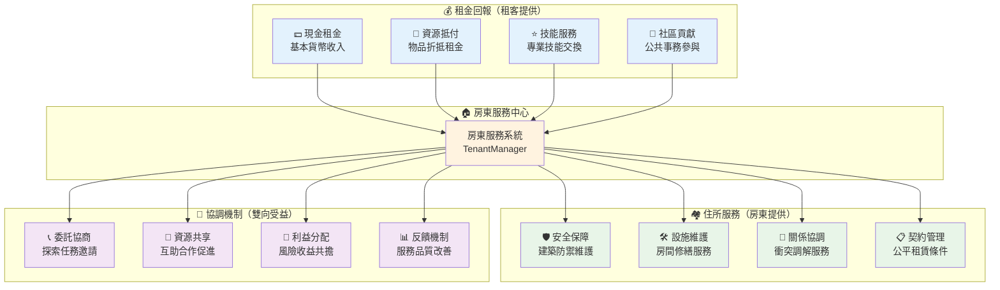
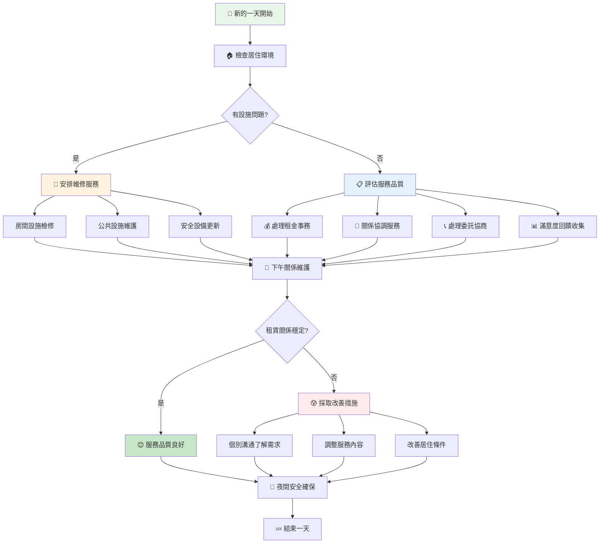
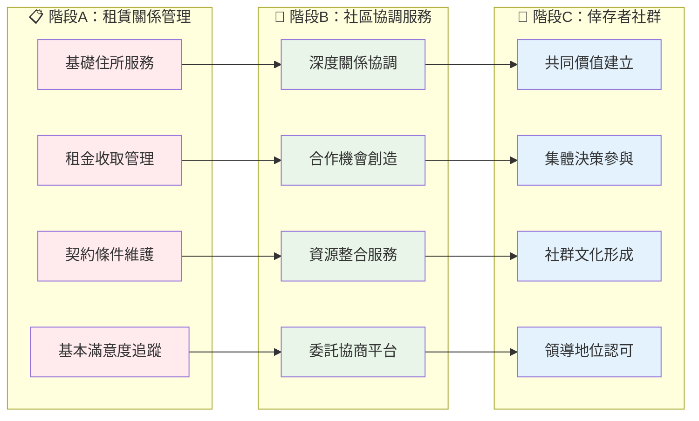
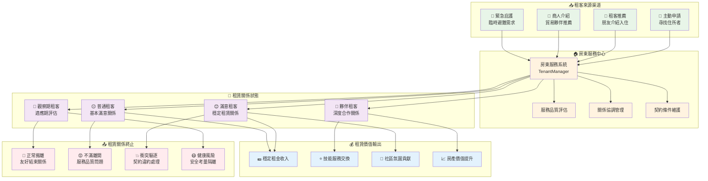

# TenantManager 架構設計文檔

## 📊 文檔概覽

本文檔深入解析 TenantManager 的架構設計理念、業務邏輯與系統整體規劃。作為末日房東模擬器租賃關係管理的核心模組，TenantManager 承載著房東在末日世界中最基本的商業職責：**提供安全住所並維護租賃契約關係**。

**文檔用途**：系統架構理解、設計理念傳承、業務邏輯規劃  
**目標讀者**：系統設計者、核心開發者、遊戲性規劃者  
**遊戲定位**：末日房東模擬器 - 小型單人經營遊戲  

---

## 🎯 模組定位與職責邊界

### 遊戲世界觀下的角色定位

TenantManager 在末日房東模擬器中扮演**租賃關係與社區協調系統**的角色，其設計哲學基於末日世界中房東的基本職責：

#### **房東生存法則：互利共生的契約關係**
```
房東本體 → 提供安全住所 → 收取合理租金 → 維持房產運作 → 協調租客關係
```
- **核心理念**：房東與租客是平等的契約關係，而非從屬關係
- **商業策略**：透過提供優質居住服務，維持穩定的租金收入
- **協調角色**：作為中立第三方，促進租客間的良性互動

#### **租賃關係的房東視角**
```
房東服務 → 租客滿意 → 續租意願 → 穩定收入 → 房產改善 → 服務提升
```
- **住所提供**：房東提供安全、舒適的居住環境
- **契約維護**：確保租賃條件的公平性與透明性
- **服務協調**：協助租客間的資源共享與合作
- **關係調解**：中性處理租客間的糾紛與衝突

#### **租客自主性的尊重機制**
```
個人選擇 → 自主決策 → 平等協商 → 互利合作 → 共同生存
```
- **居住自由**：租客有選擇居住條件和離開的自由
- **資源自主**：租客的個人財產不受房東干預
- **合作自願**：技能共享和互助完全基於自願原則
- **決策參與**：重要事項可邀請租客代表參與討論

### 業務邊界與職責劃分

| 職責類別 | TenantManager 負責 | 其他模組負責 |
|---------|-------------------|-------------|
| **租賃契約管理** | ✅ 租金收取、滿意度追蹤、契約條件維護 | ❌ 具體居住條件改善 |
| **關係協調** | ✅ 衝突調解、溝通促進、合作機會識別 | ✅ 基於關係狀態調整策略 |
| **委託服務** | ✅ 協商機制、報酬制度、風險評估 | ✅ 提供委託需求和資源 |
| **社區環境** | ✅ 居住環境維護、安全氛圍營造 | ✅ 基於環境品質制定投資策略 |
| **個人隱私** | ❌ 干預租客個人事務 | ✅ 租客個人資源和決策自主權 |

---

## 🏗️ 核心架構設計理念

### 租賃服務導向架構

#### 設計原則：房東視角的服務提供者定位

**核心問題**：如何讓房東在末日世界中建立可持續的租賃商業模式？

**解決方案**：建立以服務品質為核心的租賃關係管理體系



#### 房東服務品質決策支援系統

**決策支援原則**：為房東提供充分資訊，改善服務品質
```javascript
// 房東視角的服務品質評估
getServiceQualityAssessment() {
    return {
        housingCondition: 居住環境品質評估,
        safetyLevel: 安全保障水準,
        conflictResolution: 衝突處理效率,
        contractFairness: 契約條件公平性,
        cooperationOpportunity: 合作機會創造,
        recommendations: 房東服務改善建議
    };
}

// 房東服務改善建議範例
recommendations: [
    "房間維修可顯著提升租客滿意度",
    "建築防禦加強有助於安全感提升",
    "增加公共設施可促進租客間交流",
    "調整租金結構可提高續租率"
]
```

### 委託協商優先架構

#### 設計理念：平等協商取代指派命令

**重新定義搜刮派遣系統**：
1. **委託關係**：房東提出需求，租客自主決定是否接受
2. **協商機制**：報酬和風險由雙方協商決定
3. **自主選擇**：租客可拒絕委託，無懲罰機制
4. **風險共擔**：失敗責任由雙方按協議分擔

```javascript
// 委託探索系統的協商架構
const DELEGATION_NEGOTIATION_SYSTEM = {
    initiationPhase: {
        landlordRequest: '房東提出探索需求',
        resourceAssessment: '評估所需資源和潛在收益',
        riskAnalysis: '分析外出探索的風險等級',
        compensationProposal: '提出基本報酬方案'
    },
    
    negotiationPhase: {
        tenantConsideration: '租客評估個人能力與風險承受度',
        counterOffer: '租客可提出修改後的條件',
        teamFormation: '租客可邀請其他租客組隊',
        finalAgreement: '雙方達成最終協議'
    },
    
    executionPhase: {
        autonomousDecision: '租客在執行過程中保有決策權',
        communicationProtocol: '與房東保持必要的溝通',
        adaptiveStrategy: '可根據現場狀況調整計劃',
        safetyFirst: '安全第一，可隨時決定撤退'
    },
    
    settlementPhase: {
        resultEvaluation: '雙方共同評估探索結果',
        rewardDistribution: '按協議分配收益',
        riskConsequences: '失敗後果按協議承擔',
        relationshipImpact: '協商過程影響雙方關係'
    }
};
```

### 滿意度導向服務品質管理

#### 末日世界的居住服務品質

**基本假設**：在末日世界中，安全住所是稀缺商品，但租客仍有選擇權
- **安全需求**：房東提供的物理安全是最基本價值
- **公平感受**：租賃條件的公平性直接影響續租意願
- **尊重體驗**：被當作平等夥伴而非下屬的感受
- **發展機會**：個人技能和未來發展的支持程度
- **社區氛圍**：與其他租客和諧相處的環境品質

```javascript
// 末日世界的租賃滿意度模型
const RENTAL_SATISFACTION_MODEL = {
    basicSafety: {
        importance: 'critical',
        factors: ['建築防禦', '醫療支援', '食物穩定'],
        impact: '基礎生存需求，缺失會立即考慮搬離'
    },
    contractFairness: {
        importance: 'high',
        factors: ['租金合理性', '條件透明性', '變更協商'],
        impact: '不公平的契約條件會快速累積不滿'
    },
    personalRespect: {
        importance: 'high',
        factors: ['決策參與', '隱私尊重', '個人財產保護'],
        impact: '缺乏尊重的租客會尋找更好的居住選擇'
    },
    developmentSupport: {
        importance: 'medium',
        factors: ['技能發揮機會', '個人成長支持', '未來規劃'],
        impact: '發展機會影響長期居住意願'
    },
    communityHarmony: {
        importance: 'medium',
        factors: ['人際關係', '衝突處理', '共同活動'],
        impact: '和諧氛圍影響生活品質和歸屬感'
    }
};
```

---

## 🔄 核心業務流程設計

### 房東日常租賃服務週期

#### 每日服務品質維護流程



### 委託協商的房東策略

#### 為什麼委託協商是房東的核心服務延伸？

**戰略意義分析**：
1. **服務多元化**：擴展房東服務範圍，增加收入來源
2. **關係深化**：透過合作建立更深層的信任關係
3. **風險分散**：讓租客承擔部分外出風險，房東提供後勤支援
4. **價值創造**：為租客提供額外收入機會，提升居住價值

```javascript
// 委託協商的房東價值模型
const DELEGATION_VALUE_MODEL = {
    serviceExtension: {
        basicService: '住所提供',           // 基礎服務
        extendedService: '探索協調',        // 延伸服務
        valueAddition: '收入機會創造',      // 附加價值
        relationshipDepth: '夥伴關係建立'   // 關係深化
    },
    
    negotiationBenefits: {
        landlordBenefits: [
            '獲得外部資源無需親自冒險',
            '建立更深層的租客關係',
            '創造額外服務收入來源',
            '提升房產整體價值'
        ],
        tenantBenefits: [
            '獲得額外收入機會',
            '發揮個人專業技能',
            '參與重要決策過程',
            '建立平等夥伴關係'
        ]
    },
    
    riskMitigation: {
        sharedResponsibility: '風險責任共同承擔',
        informationSharing: '風險資訊透明化',
        flexibleTerms: '協商條件彈性化',
        trustBuilding: '透過合作建立信任'
    }
};
```

### 租賃關係演進的自然發展

#### 房東如何從服務提供者演進為社區協調者

**演進哲學**：租賃關係的自然深化過程



---

## 🎯 租賃關係流轉控制架構

### 房東視角的租賃關係流動模型

#### 以服務品質為核心的關係管理控制



### 三級租賃服務預警系統

#### 為房東提供分級服務品質管理

**預警哲學**：提前識別服務品質問題，維護良好租賃關係

| 預警等級 | 房東反應時間 | 建議行動 | 行動性質 |
|---------|------------|----------|-----------|
| **🟡 關注** | 3-5天觀察期 | 主動關懷與服務改善 | 預防性服務 |
| **🟠 警告** | 1-2天處理期 | 積極溝通並調整服務 | 修復性服務 |
| **🔴 危急** | 立即處理 | 緊急服務改善或協商 | 挽救性服務 |

```javascript
// 房東租賃服務預警決策支援
generateServiceAlert(tenantName, alertType, severity) {
    const alertConfig = {
        satisfaction_declining: {
            urgency: 'medium',
            timeframe: '未來2-3天',
            actions: [
                '主動詢問居住體驗和需求',
                '檢查房間設施是否需要改善',
                '評估租賃條件是否需要調整',
                '提供額外服務或便利'
            ],
            tone: '服務品質改善建議'
        },
        contract_concern: {
            urgency: 'high',
            timeframe: '1天內',
            actions: [
                '重新檢視契約條件公平性',
                '與租客協商條件調整',
                '確保契約透明度和可理解性',
                '提供更靈活的支付選項'
            ],
            tone: '契約關係維護指示'
        },
        relationship_tension: {
            urgency: 'high',
            timeframe: '立即處理',
            actions: [
                '安排私人對話了解問題',
                '提供中性的調解環境',
                '尋求雙方都能接受的解決方案',
                '必要時邀請第三方協助調解'
            ],
            tone: '關係修復緊急處理'
        }
    };
    
    return {
        message: `${tenantName} ${alertType}：${alertConfig[alertType].timeframe}需要服務關注`,
        recommendations: alertConfig[alertType].actions,
        serviceNature: alertConfig[alertType].tone
    };
}
```

---

## 📈 架構演進規劃

### 短期優化：深化租賃服務體驗（v2.1）

#### 1. **契約關係管理強化**
- **動態租賃條件**：根據市場情況和租客需求調整租賃條件
- **服務品質標準**：建立明確的住所服務品質評估標準
- **租客回饋機制**：定期收集租客對居住體驗的回饋意見

#### 2. **委託協商系統完善**
- **協商界面優化**：提供直觀的委託條件協商界面
- **風險評估工具**：幫助雙方更好地評估探索任務風險
- **組隊協調功能**：支援租客間的自主組隊機制

#### 3. **關係深度追蹤**
- **信任度量化**：建立房東與租客間的信任度評估系統
- **合作歷史記錄**：追蹤雙方的合作成功率和滿意度
- **個性化服務**：基於租客偏好提供客製化的住所服務

### 中期擴展：社區協調服務深度（v3.0）

#### 1. **房東服務角色發展**
- **專業服務提供**：房東可學習提供更專業的住所管理服務
- **社區活動組織**：協調租客間的集體活動和合作項目
- **資源整合平台**：成為租客間資源交換的協調平台

#### 2. **社區共識建設**
- **共同規則制定**：與租客共同制定社區生活規範
- **集體決策機制**：重要事項的民主決策流程
- **利益分享制度**：建立公平的利益分享和責任分擔機制

#### 3. **協調服務進階功能**
- **衝突預防系統**：識別並預防潛在的租客間衝突
- **合作機會創造**：主動識別和創造租客間的合作機會
- **社區發展規劃**：與租客共同規劃社區的長期發展

### 長期願景：倖存者社群領導者（v4.0+）

#### 1. **社群共同體建設**
- **共享價值體系**：建立社群成員共同認同的價值觀
- **集體身份認同**：形成強烈的社群歸屬感和身份認同
- **文化傳統建立**：創建社群獨特的文化傳統和慣例

#### 2. **外部關係拓展**
- **社群間交流**：與其他倖存者社群建立交流合作關係
- **聯盟網絡建設**：參與或建立倖存者社群聯盟網絡
- **知識技能共享**：在更大範圍內分享社群的知識和技能

#### 3. **文明重建參與**
- **社會制度建設**：參與重建末日後的社會制度和秩序
- **教育體系建立**：建立面向未來的教育和傳承體系
- **希望與願景**：成為重建文明希望的重要力量

### 演進實施策略

#### **遊戲性實施考量**
```javascript
// v2.1 委託協商系統預覽
class DelegationNegotiation {
    initiateDelegation(requirement, baseOffer) {
        const delegationRequest = {
            requirement: requirement,           // 探索需求描述
            baseCompensation: baseOffer,       // 基礎報酬
            riskAssessment: this.assessRisk(requirement),
            negotiationSpace: this.defineNegotiationParameters(),
            timeLimit: this.setNegotiationDeadline()
        };
        
        return this.presentToTenants(delegationRequest);
    }
    
    processNegotiation(tenantResponse, landlordOffer) {
        const negotiationResult = {
            agreedTerms: this.findCommonGround(tenantResponse, landlordOffer),
            riskSharing: this.allocateRiskResponsibility(),
            compensationStructure: this.finalizeCompensation(),
            safeguards: this.establishSafeguards()
        };
        
        return this.createFormalAgreement(negotiationResult);
    }
    
    generateLandlordGuidance(negotiationContext) {
        return {
            fairnessAssessment: '確保條件對雙方都公平',
            riskBalance: '合理分配風險和收益',
            relationshipImpact: '考慮對長期關係的影響',
            alternativeOptions: '準備備選方案和條件'
        };
    }
}
```

#### **關係演進考量**
- **自然發展**：從商業關係自然演進為夥伴關係，再到社群關係
- **選擇性發展**：不強制所有租客都必須發展深度關係
- **多樣化路徑**：提供不同性格租客的不同發展路徑
- **可逆性設計**：允許關係在某些情況下退回到更簡單的層次
