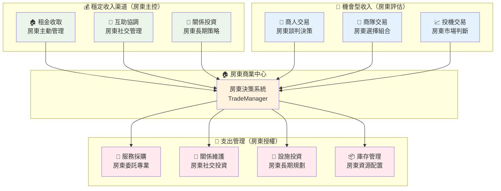
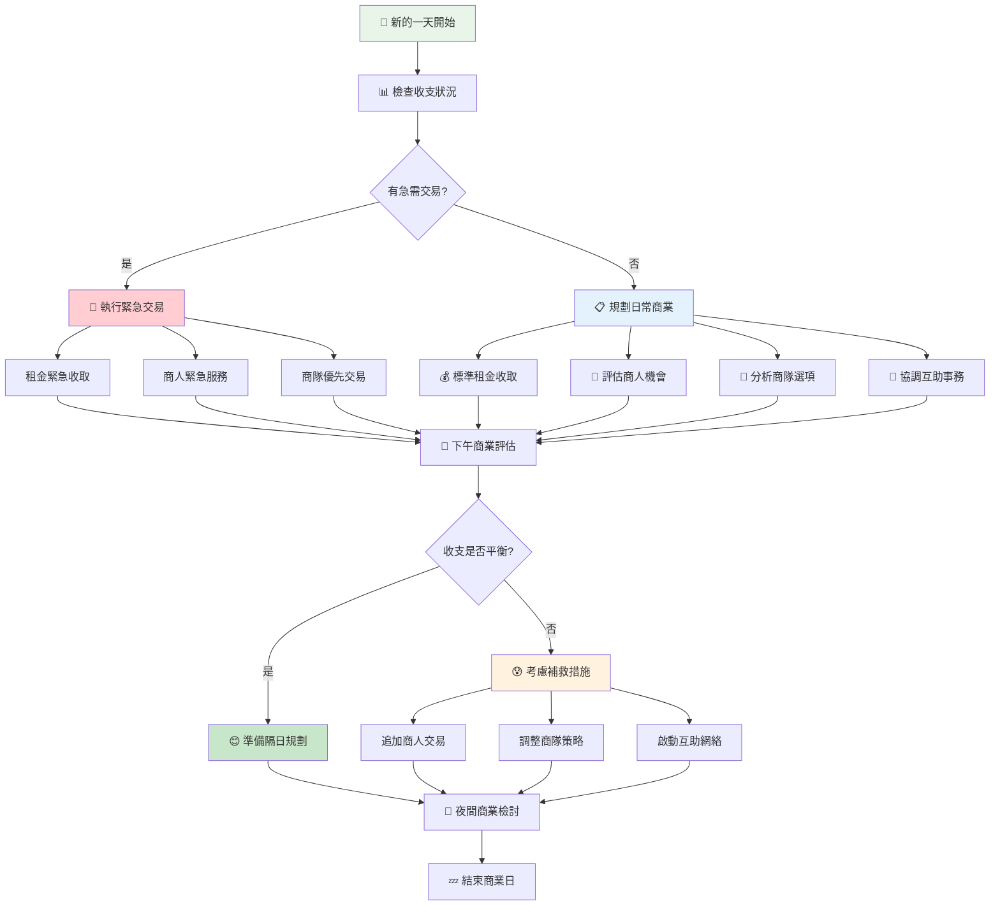
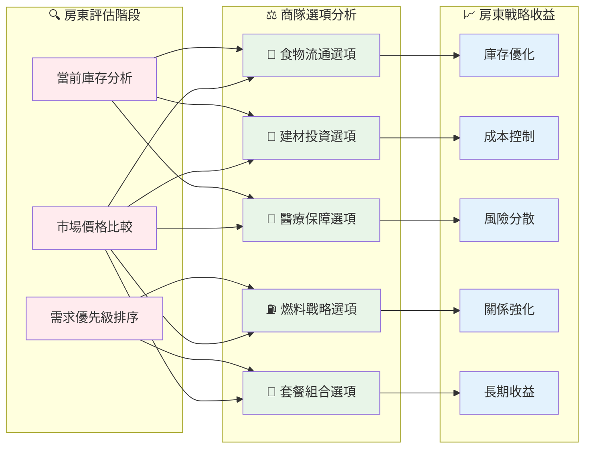
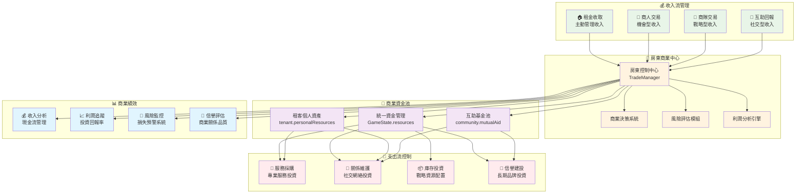

# TradeManager 架構設計文檔

## 📊 文檔概覽

本文檔深入解析TradeManager的架構設計理念、業務邏輯與系統整體規劃。作為末日房東模擬器商業交易控制的核心模組，TradeManager承載著房東經營決策的商業化戰略職責。

**文檔用途**：系統架構理解、設計理念傳承、商業邏輯規劃  
**目標讀者**：系統設計者、核心開發者、遊戲性規劃者  
**遊戲定位**：末日房東模擬器 - 小型單人經營遊戲  

---

## 🎯 模組定位與職責邊界

### 遊戲世界觀下的角色定位

TradeManager在末日房東模擬器中扮演**房東商業決策支援系統**的角色，其設計哲學基於房東的商業化生存策略：

#### **房東商業化生存法則：談判桌上的智慧**
```
房東本體 → 不外出交易 → 透過談判獲得資源 → 維持商業優勢
```
- **核心理念**：房東作為商業談判者，不親自外出尋找交易機會
- **生存策略**：透過智慧交易決策和關係管理獲得資源
- **風險控制**：避免房東直接面對外界商業風險

#### **商業交易的房東視角**
```
房東決策 → 交易執行 → 資源回流 → 關係強化 → 吸引更多機會
```
- **租金收取**：房東主動管理的穩定收入來源
- **商人交易**：被動等待商機，房東評估交易價值
- **商隊交易**：定期商業機會，房東選擇最佳組合
- **互助管理**：透過協調租客關係，創造雙贏局面

#### **商業管理的戰略思維**
```
基礎收入 → 商業擴展 → 關係網絡 → 市場領導
```
- **基礎階段**：穩定租金收入，建立基本商業循環
- **擴展階段**：多元化交易管道，優化資源配置
- **網絡階段**：建立穩固的商業關係網
- **領導階段**：成為區域內最重要的交易中心

### 業務邊界與職責劃分

| 職責類別 | TradeManager負責 | 其他模組負責 |
|---------|-----------------|-------------|
| **交易決策制定** | ✅ 評估交易價值、選擇最佳方案 | ❌ 具體資源管理執行 |
| **商業關係管理** | ✅ 商人信譽、互助協調 | ❌ 租客個人關係細節 |
| **價格談判** | ✅ 交易條件評估、價格合理性 | ❌ 資源市場價值設定 |
| **收入管理** | ✅ 租金政策、收取策略 | ❌ 日常開支控制 |
| **商機識別** | ✅ 商隊選項分析、商人評估 | ❌ 市場資訊收集 |

---

## 🏗️ 核心架構設計理念

### 房東中心化商業管理

#### 設計原則：房東視角的商業控制

**核心問題**：如何讓房東在不外出的情況下有效管理所有商業活動？

**解決方案**：建立房東中心化的商業決策與交易執行體系



#### 房東商業決策支援系統

**決策支援原則**：為房東提供完整商業資訊，支援最佳交易選擇
```javascript
// 房東視角的交易機會評估
getTradeOpportunityAnalysis(tradeType) {
    return {
        currentMarketValue: 交易當前價值,
        profitMargin: 利潤空間分析,
        riskAssessment: 風險等級評估,
        alternativeOptions: 替代方案比較,
        timingSuggestion: 最佳交易時機,
        relationshipImpact: 關係影響分析,
        recommendations: 房東決策建議
    };
}

// 房東商業決策建議範例
recommendations: [
    "商隊燃料交易利潤率15%，建議執行",
    "醫生商人服務價格偏高，建議議價", 
    "租客互助活躍，可減少直接投資",
    "建材庫存充足，適合批量出售"
]
```

### 四層交易體系架構

#### 設計理念：分層風險管理的商業模式

**交易分層策略**：
1. **穩定基礎層**：租金收取（可預測收入，房東主控）
2. **社交管理層**：互助協調（關係投資，長期回報）
3. **機會把握層**：商人交易（主動評估，短期獲利）
4. **戰略選擇層**：商隊交易（組合優化，資源配置）

```javascript
// 交易優先級與風險評估
assessTradePortfolio() {
    const portfolio = {
        // 第一層：穩定收入（80%資金來源目標）
        stableIncome: {
            rentCollection: {
                stability: 'high',
                predictability: 'very_high',
                landlordControl: 'complete',
                riskLevel: 'minimal'
            },
            mutualAidReturn: {
                stability: 'medium',
                predictability: 'medium',
                landlordControl: 'moderate',
                riskLevel: 'low'
            }
        },
        
        // 第二層：機會交易（15%資金來源目標）
        opportunityTrades: {
            merchantDeals: {
                stability: 'low',
                predictability: 'low',
                landlordControl: 'high',
                riskLevel: 'medium'
            },
            caravanExchange: {
                stability: 'medium',
                predictability: 'medium',
                landlordControl: 'high',
                riskLevel: 'medium'
            }
        },
        
        // 第三層：戰略投資（5%資金來源目標）
        strategicInvestment: {
            relationshipBuilding: {
                stability: 'low',
                predictability: 'very_low',
                landlordControl: 'complete',
                riskLevel: 'high'
            }
        }
    };
    
    return portfolio;
}
```

### 智慧交易選擇哲學

#### 末日世界的商業現實

**基本假設**：在末日世界中，所有交易都存在資訊不對稱和風險
- **租金**：最可控的收入來源，但受限於租客資源
- **商人**：專業但不定期，價格可能波動
- **商隊**：批量優惠但選擇有限，需要組合優化
- **互助**：社交投資，長期關係建設的基礎

```javascript
// 末日世界的商業風險模型
const BUSINESS_RISK_MODEL = {
    rentCollection: {
        riskFactor: 'low',
        variability: 'seasonal',        // 租客收入波動
        mitigation: ['資源抵付', '房間加固', '多元租客'],
        maxLossThreshold: '單月租金10%'
    },
    merchantTrade: {
        riskFactor: 'medium',
        variability: 'high',           // 商人來訪不定期
        mitigation: ['服務優先', '多重選擇', '價格比較'],
        maxLossThreshold: '交易金額20%'
    },
    caravanTrade: {
        riskFactor: 'medium',
        variability: 'structured',      // 有規律但選項有限
        mitigation: ['組合優化', '庫存管理', '需求預測'],
        maxLossThreshold: '每日收入30%'
    },
    mutualAid: {
        riskFactor: 'low',
        variability: 'relationship_based', // 基於租客關係
        mitigation: ['關係投資', '公平調解', '長期規劃'],
        maxLossThreshold: '關係維護成本'
    }
};
```

---

## 🔄 核心業務流程設計

### 房東日常商業管理週期

#### 每日商業決策流程



### 租金收取的商業價值

#### 為什麼租金收取是房東的核心商業策略？

**商業意義分析**：
1. **現金流穩定性**：提供可預測的每日現金流入
2. **談判籌碼**：建立房東與租客的商業關係基礎
3. **風險分散**：透過資源抵付，實現收入多元化
4. **增值服務**：透過房間加固，提升租金價值

```javascript
// 租金收取的房東商業價值模型
const RENT_COLLECTION_VALUE = {
    cashFlowBenefits: {
        predictability: 'high',         // 高可預測性
        regularity: 'daily',           // 每日規律收入
        scalability: 'tenant_based',   // 基於租客數量擴展
        diversification: 'resource_payment' // 資源抵付多元化
    },
    
    businessRelationshipBenefits: {
        landlordAuthority: true,        // 確立房東權威
        tenantDependency: true,         // 建立租客依賴
        negotiationPower: 'enhanced',   // 增強談判力
        trustBuilding: 'gradual'        // 漸進式信任建立
    },
    
    strategicLimitations: {
        tenantResourceLimit: '租客個人資源上限',
        economicCycleImpact: '經濟週期影響',
        relationshipRisk: '關係惡化風險',
        competitiveThreats: '其他房東競爭'
    }
};
```

### 商隊交易的戰略選擇系統

#### 房東如何透過商隊組合優化實現資源配置

**選擇哲學**：房東評估25種交易選項，選擇3-5種最佳組合，實現效益最大化



---

## 🎯 商業流轉控制架構

### 房東視角的商業流動模型

#### 以房東決策為核心的商業控制



### 四層商業預警系統的房東應用

#### 為房東提供分級商業風險管理

**預警哲學**：給房東充分的商業反應時間，避免收支危機

| 預警等級 | 房東反應時間 | 建議行動 | 商業緊迫性 |
|---------|------------|----------|-----------|
| **🟢 穩定** | 長期規劃期 | 擴展商業網絡、投資關係 | 戰略發展 |
| **🟡 注意** | 3-5天準備期 | 評估交易機會、調整策略 | 主動優化 |
| **🟠 緊急** | 1-2天反應期 | 立即執行高價值交易 | 緊急應對 |
| **🔴 危機** | 當日必須處理 | 動用所有商業資源 | 生存危機 |

```javascript
// 房東商業預警決策支援
generateBusinessAlert(cashFlow, timeframe, severity) {
    const alertConfig = {
        stable: {
            urgency: 'strategic',
            timeframe: '長期規劃',
            actions: [
                '評估房間加固投資回報',
                '建立新的商人關係',
                '分析商隊交易趨勢',
                '投資租客關係網絡'
            ],
            tone: '戰略發展機會'
        },
        attention: {
            urgency: 'optimization',
            timeframe: '未來3-5天',
            actions: [
                '提前收取租金',
                '評估商人交易機會',
                '調整商隊交易策略',
                '協調租客互助網絡'
            ],
            tone: '主動優化建議'
        },
        urgent: {
            urgency: 'immediate',
            timeframe: '1-2天內',
            actions: [
                '執行所有可收租金',
                '接受有利商人交易',
                '優先選擇高價值商隊交易',
                '動員租客互助資源'
            ],
            tone: '緊急商業行動'
        },
        crisis: {
            urgency: 'survival',
            timeframe: '今日內',
            actions: [
                '動用所有商業管道',
                '接受任何有利交易',
                '啟動緊急互助協議',
                '考慮資產變現'
            ],
            tone: '商業生存危機'
        }
    };
    
    return {
        message: `商業狀況${alertConfig[severity].urgency}：${alertConfig[severity].timeframe}需要行動`,
        recommendations: alertConfig[severity].actions,
        businessUrgency: alertConfig[severity].urgency
    };
}
```

---

## 📈 架構演進規劃

### 短期優化：深化房東商業體驗（v2.1）

#### 1. **房東商業決策強化**
- **交易機會預測**：基於歷史資料預測未來3-7天商業機會
- **利潤最佳化引擎**：為房東提供個人化的交易組合建議
- **商業風險評估面板**：量化不同交易方式的風險與回報比

#### 2. **租金管理深化**
- **動態租金定價**：根據房間品質、市場狀況調整租金策略
- **租客信用系統**：基於支付歷史建立租客信用評級
- **抵付資源評估**：更精確的資源價值評估和抵付策略

#### 3. **商業關係網絡完善**
- **商人信譽追蹤**：記錄商人交易歷史，建立信譽檔案
- **互助網絡管理**：可視化租客間互助關係和影響力
- **商隊偏好學習**：基於選擇歷史優化商隊推薦算法

### 中期擴展：商業帝國深度（v3.0）

#### 1. **房東專業化發展**
- **商業技能樹**：房東透過交易經驗解鎖高級商業能力
- **市場影響力系統**：成功經營提升房東在區域的商業地位
- **經營策略分支**：保守穩健vs激進擴張vs關係導向的不同發展路線

#### 2. **商業價值提升系統**
- **房產商業化**：會議室、交易所、倉庫等商業功能空間
- **服務多元化**：從單純租房到提供多種商業服務
- **品牌價值**：建立房東個人品牌，影響交易條件和機會

#### 3. **區域商業網絡**
- **商業聯盟**：與其他房東建立商業合作關係
- **市場資訊網**：透過關係網獲得商業資訊和預警
- **集體議價**：聯合其他房東提升對商隊的議價能力

### 長期願景：商業領袖地位（v4.0+）

#### 1. **區域商業中心**
- **交易樞紐**：成為區域內重要的商業交易中心
- **商業仲介**：為其他倖存者提供交易撮合服務
- **標準制定者**：建立區域內商業交易的標準和規則

#### 2. **可持續商業模式**
- **循環經濟**：建立資源循環利用的商業生態系統
- **創新服務**：開發末日世界特有的新型商業服務
- **品牌授權**：將成功的商業模式授權給其他經營者

#### 3. **故事深度整合**
- **商業傳奇**：透過商業成就體驗從小房東到商業領袖的成長
- **多重結局**：基於商業策略的不同故事結局（商業巨頭、慈善家、黑心商人）
- **角色成長**：房東從普通經營者成長為商業領袖的完整故事弧

### 演進實施策略

#### **商業實施考量**
```javascript
// v2.1 商業智慧系統架構預覽
class BusinessIntelligence {
    analyzeTradingPatterns(days = 30) {
        const tradingHistory = this.getTradeHistory(days);
        const patterns = {
            mostProfitableType: this.calculateMostProfitable(tradingHistory),
            optimalTiming: this.findOptimalTradingTimes(tradingHistory),
            riskProfile: this.assessRiskTolerance(tradingHistory),
            relationshipImpact: this.analyzeRelationshipROI(tradingHistory)
        };
        
        return {
            insights: this.generateBusinessInsights(patterns),
            recommendations: this.createActionPlan(patterns),
            predictions: this.forecastOpportunities(patterns)
        };
    }
    
    generateTradingStrategy(currentSituation, goals) {
        const strategy = [];
        
        // 基於風險偏好制定策略
        if (currentSituation.riskTolerance === 'conservative') {
            strategy.push({
                priority: 'high',
                action: 'focus_on_rent_collection',
                reasoning: '穩定現金流優先'
            });
        }
        
        if (currentSituation.cashFlow < goals.targetCashFlow) {
            strategy.push({
                priority: 'urgent',
                action: 'optimize_caravan_trades',
                reasoning: '需要快速增加收入'
            });
        }
        
        return strategy.sort((a, b) => 
            this.priorityWeight[a.priority] - this.priorityWeight[b.priority]
        );
    }
}
```

#### **遊戲性演進考量**
- **漸進複雜度**：從簡單的租金收取逐步發展到複雜的商業網絡經營
- **策略深度**：提供多種有效的商業策略，避免唯一最優解
- **風險平衡**：在提供更多商業機會的同時保持適度的經營壓力
- **成就感遞增**：每個發展階段都有明確的商業成就和進步反饋
