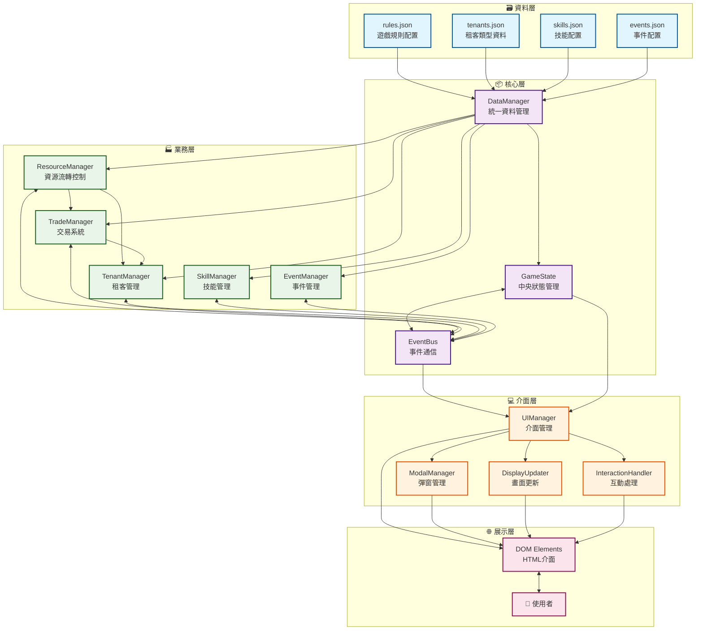
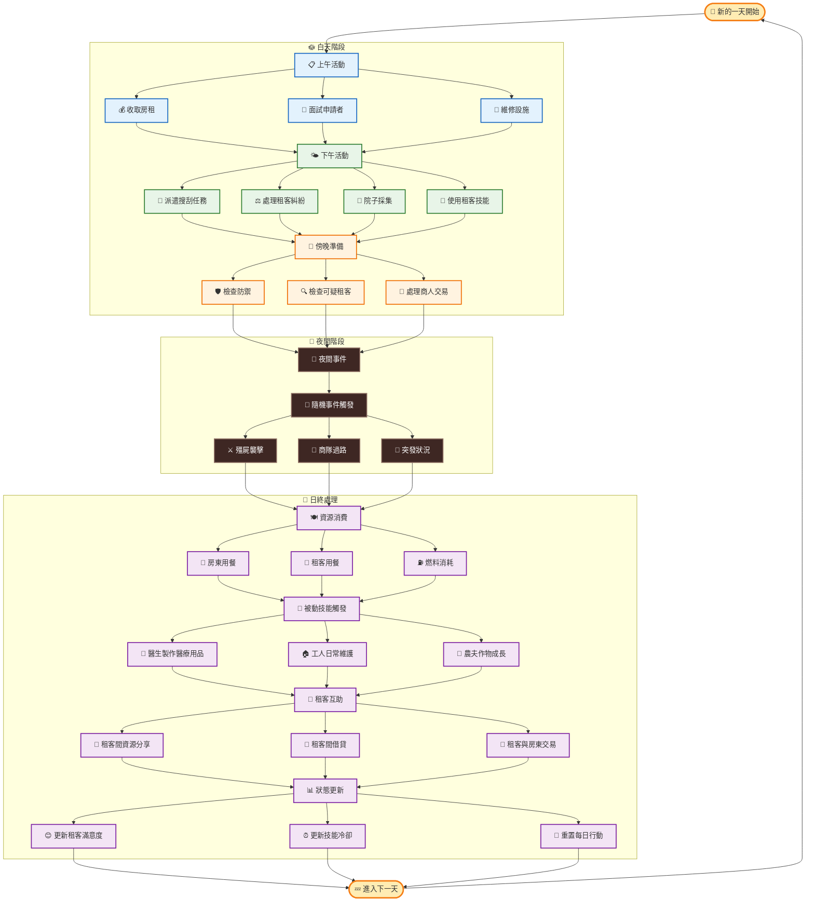
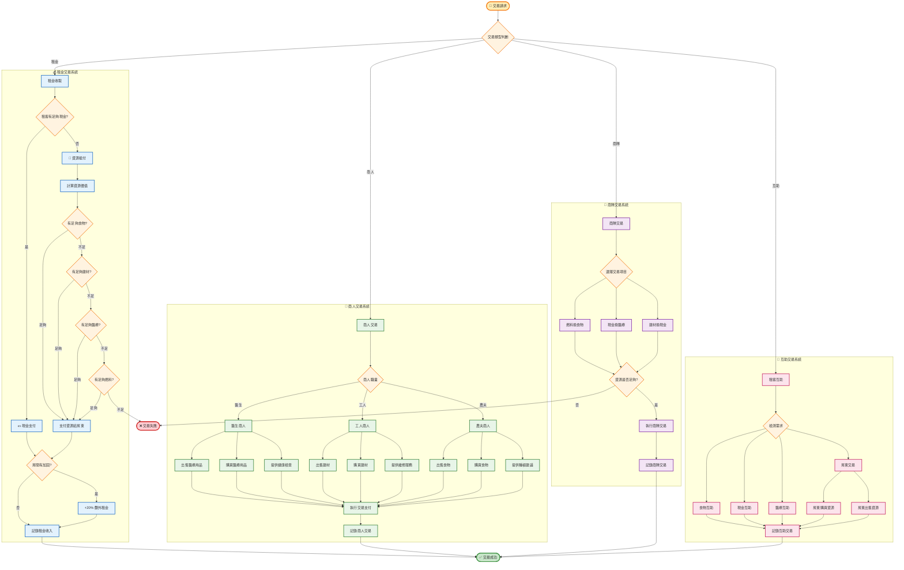
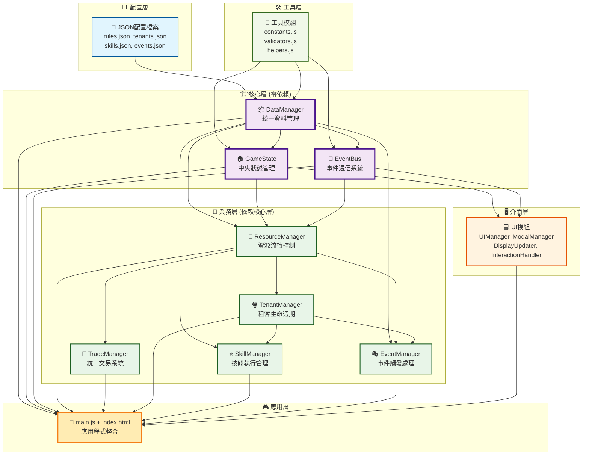
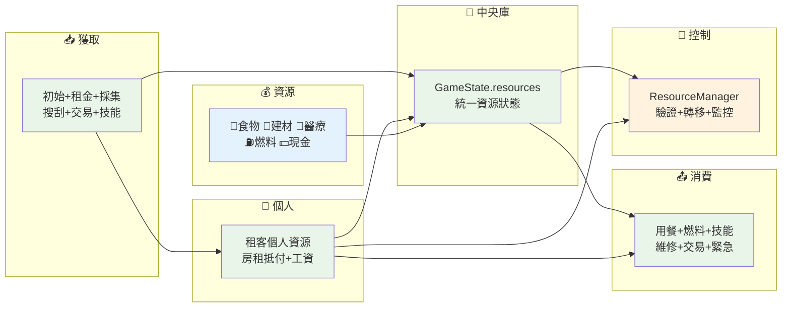

# 末日房東模擬器 - 系統流程圖集 v2.0

## 📊 圖表概覽

本文件包含末日房東模擬器完整的系統架構與流程圖表，共計7張核心圖表，涵蓋系統架構、業務流程、模組依賴關係等關鍵設計要素。

**圖表清單**：
1. [總體系統架構圖](#1-總體系統架構圖) - 六層架構模式與模組依賴
2. [每日循環流程圖](#2-每日循環流程圖) - 完整的遊戲日循環機制
3. [交易系統流程圖](#3-交易系統流程圖) - 四種交易類型統一處理
4. [事件系統流程圖](#4-事件系統流程圖) - 動態事件觸發與處理機制
5. [模組依賴關係圖](#5-模組依賴關係圖) - 清晰的模組間依賴鏈
6. [技能系統架構圖](#6-技能系統架構圖) - 20個技能的分類管理
7. [資源流轉管理圖](#7-資源流轉管理圖) - 統一資源流向控制

---

## 1. 總體系統架構圖

---

## 2. 每日循環流程圖

---

## 3. 交易系統流程圖

---

## 4. 事件系統流程圖

```mermaid
graph TD
    START([🎲 事件觸發檢查])
    
    TRIGGER{事件觸發類型}
    
    subgraph "🎯 隨機事件系統"
        RANDOM_CHECK[隨機機率檢查<br/>30% 基礎機率]
        RANDOM_POOL[選擇可用事件]
        RANDOM_COND{檢查觸發條件}
        
        subgraph "⚔️ 殭屍襲擊"
            ZOMBIE[🧟 殭屍襲擊事件]
            ZOM_CHOICE{玩家選擇}
            ZOM_DEFEND[🛡️ 加固防禦<br/>-5建材]
            ZOM_ATTACK[⚔️ 冒險反擊]
            ZOM_SOLDIER{有軍人租客?}
            ZOM_SUCCESS[✅ 成功抵禦]
            ZOM_FAIL[💥 房屋受損]
        end
        
        subgraph "🚛 商隊過路"
            CARAVAN[🚛 商隊過路事件]
            CAR_CHOICE{選擇交易}
            CAR_FUEL[⛽ 燃料換食物]
            CAR_CASH[💰 現金換醫療]
            CAR_MATERIALS[🔧 建材換現金]
            CAR_REFUSE[❌ 拒絕交易]
        end
    end
    
    subgraph "⚖️ 衝突事件系統"
        CONFLICT_CALC[計算衝突機率]
        CONFLICT_BASE[基礎機率 25%]
        CONFLICT_MOD[修正因子]
        TENANT_COUNT[租客數量影響]
        SATISFACTION[滿意度影響]
        RESOURCE_LACK[資源稀缺影響]
        ELDER_BONUS[長者和諧加成]
        
        CONFLICT_POOL[選擇衝突類型]
        
        subgraph "🍖 資源分配糾紛"
            RES_CONFLICT[資源分配糾紛]
            RES_CHOICE{解決方案}
            RES_INCREASE[增加共用資源]
            RES_RULES[制定使用規則]
            RES_ELDER[長者調解]
            RES_IGNORE[任由發展]
        end
        
        subgraph "🔊 噪音投訴"
            NOISE_CONFLICT[噪音投訴]
            NOISE_CHOICE{解決方案}
            NOISE_SUPPORT[支持投訴方]
            NOISE_WORKER[工人安裝隔音]
            NOISE_ELDER[長者調解]
        end
    end
    
    subgraph "🚨 特殊事件系統"
        SPECIAL_TRIGGER[特殊觸發條件]
        SPECIAL_POOL[特殊事件池]
        
        subgraph "💊 醫療緊急狀況"
            MEDICAL_EMERGENCY[醫療緊急狀況]
            MED_CHOICE{處理方式}
            MED_SUPPLIES[使用醫療用品]
            MED_DOCTOR[請醫生處理]
            MED_NOTHING[無法協助]
            MED_RESULT{結果機率}
            MED_HEAL[租客康復]
            MED_LEAVE[租客離開]
        end
        
        subgraph "🏗️ 建築危機"
            BUILDING_CRISIS[建築危機]
            BUILD_CHOICE{應對措施}
            BUILD_REPAIR[緊急維修]
            BUILD_EVACUATE[疏散租客]
            BUILD_RISK[冒險忽視]
        end
    end
    
    subgraph "📅 腳本事件系統"
        SCRIPTED_CHECK[腳本事件檢查]
        DAY_TRIGGER[特定天數觸發]
        CONDITION_TRIGGER[條件觸發]
        
        FIRST_WEEK[第7天生存指導]
        TUTORIAL_HELP[獲得建議和補給]
        
        ACHIEVEMENT[成就事件]
        MILESTONE[里程碑獎勵]
    end
    
    EVENT_EXECUTE[執行事件效果]
    UPDATE_STATE[更新遊戲狀態]
    LOG_EVENT[記錄事件日誌]
    NOTIFY_UI[通知介面更新]
    
    END([事件處理完成])
    
    %% 主流程
    START --> TRIGGER
    
    TRIGGER -->|隨機| RANDOM_CHECK
    TRIGGER -->|衝突| CONFLICT_CALC
    TRIGGER -->|特殊| SPECIAL_TRIGGER
    TRIGGER -->|腳本| SCRIPTED_CHECK
    
    %% 隨機事件流程
    RANDOM_CHECK --> RANDOM_POOL
    RANDOM_POOL --> RANDOM_COND
    RANDOM_COND -->|通過| ZOMBIE
    RANDOM_COND -->|通過| CARAVAN
    RANDOM_COND -->|失敗| END
    
    %% 殭屍襲擊流程
    ZOMBIE --> ZOM_CHOICE
    ZOM_CHOICE --> ZOM_DEFEND
    ZOM_CHOICE --> ZOM_ATTACK
    
    ZOM_DEFEND --> ZOM_SOLDIER
    ZOM_SOLDIER -->|是| ZOM_SUCCESS
    ZOM_SOLDIER -->|否| ZOM_SUCCESS
    
    ZOM_ATTACK --> ZOM_SOLDIER
    ZOM_SOLDIER -->|是,80%機率| ZOM_SUCCESS
    ZOM_SOLDIER -->|否,60%機率| ZOM_SUCCESS
    ZOM_SOLDIER -->|失敗| ZOM_FAIL
    
    %% 商隊流程
    CARAVAN --> CAR_CHOICE
    CAR_CHOICE --> CAR_FUEL
    CAR_CHOICE --> CAR_CASH
    CAR_CHOICE --> CAR_MATERIALS
    CAR_CHOICE --> CAR_REFUSE
    
    %% 衝突事件流程
    CONFLICT_CALC --> CONFLICT_BASE
    CONFLICT_BASE --> CONFLICT_MOD
    CONFLICT_MOD --> TENANT_COUNT
    CONFLICT_MOD --> SATISFACTION
    CONFLICT_MOD --> RESOURCE_LACK
    CONFLICT_MOD --> ELDER_BONUS
    
    TENANT_COUNT --> CONFLICT_POOL
    SATISFACTION --> CONFLICT_POOL
    RESOURCE_LACK --> CONFLICT_POOL
    ELDER_BONUS --> CONFLICT_POOL
    
    CONFLICT_POOL --> RES_CONFLICT
    CONFLICT_POOL --> NOISE_CONFLICT
    
    %% 資源糾紛流程
    RES_CONFLICT --> RES_CHOICE
    RES_CHOICE --> RES_INCREASE
    RES_CHOICE --> RES_RULES
    RES_CHOICE --> RES_ELDER
    RES_CHOICE --> RES_IGNORE
    
    %% 噪音糾紛流程
    NOISE_CONFLICT --> NOISE_CHOICE
    NOISE_CHOICE --> NOISE_SUPPORT
    NOISE_CHOICE --> NOISE_WORKER
    NOISE_CHOICE --> NOISE_ELDER
    
    %% 特殊事件流程
    SPECIAL_TRIGGER --> SPECIAL_POOL
    SPECIAL_POOL --> MEDICAL_EMERGENCY
    SPECIAL_POOL --> BUILDING_CRISIS
    
    %% 醫療緊急流程
    MEDICAL_EMERGENCY --> MED_CHOICE
    MED_CHOICE --> MED_SUPPLIES
    MED_CHOICE --> MED_DOCTOR
    MED_CHOICE --> MED_NOTHING
    
    MED_SUPPLIES --> MED_HEAL
    MED_DOCTOR --> MED_HEAL
    MED_NOTHING --> MED_RESULT
    MED_RESULT -->|60%| MED_HEAL
    MED_RESULT -->|40%| MED_LEAVE
    
    %% 建築危機流程
    BUILDING_CRISIS --> BUILD_CHOICE
    BUILD_CHOICE --> BUILD_REPAIR
    BUILD_CHOICE --> BUILD_EVACUATE
    BUILD_CHOICE --> BUILD_RISK
    
    %% 腳本事件流程
    SCRIPTED_CHECK --> DAY_TRIGGER
    SCRIPTED_CHECK --> CONDITION_TRIGGER
    
    DAY_TRIGGER --> FIRST_WEEK
    CONDITION_TRIGGER --> ACHIEVEMENT
    CONDITION_TRIGGER --> MILESTONE
    
    FIRST_WEEK --> TUTORIAL_HELP
    ACHIEVEMENT --> EVENT_EXECUTE
    MILESTONE --> EVENT_EXECUTE
    
    %% 事件結束流程
    ZOM_SUCCESS --> EVENT_EXECUTE
    ZOM_FAIL --> EVENT_EXECUTE
    CAR_FUEL --> EVENT_EXECUTE
    CAR_CASH --> EVENT_EXECUTE
    CAR_MATERIALS --> EVENT_EXECUTE
    CAR_REFUSE --> EVENT_EXECUTE
    RES_INCREASE --> EVENT_EXECUTE
    RES_RULES --> EVENT_EXECUTE
    RES_ELDER --> EVENT_EXECUTE
    RES_IGNORE --> EVENT_EXECUTE
    NOISE_SUPPORT --> EVENT_EXECUTE
    NOISE_WORKER --> EVENT_EXECUTE
    NOISE_ELDER --> EVENT_EXECUTE
    MED_HEAL --> EVENT_EXECUTE
    MED_LEAVE --> EVENT_EXECUTE
    BUILD_REPAIR --> EVENT_EXECUTE
    BUILD_EVACUATE --> EVENT_EXECUTE
    BUILD_RISK --> EVENT_EXECUTE
    TUTORIAL_HELP --> EVENT_EXECUTE
    
    EVENT_EXECUTE --> UPDATE_STATE
    UPDATE_STATE --> LOG_EVENT
    LOG_EVENT --> NOTIFY_UI
    NOTIFY_UI --> END
    
    %% 樣式
    classDef startEnd fill:#ffecb3,stroke:#f57f17,stroke-width:3px
    classDef decision fill:#fff3e0,stroke:#ef6c00,stroke-width:2px
    classDef randomEvent fill:#e3f2fd,stroke:#1565c0,stroke-width:2px
    classDef conflictEvent fill:#fce4ec,stroke:#c2185b,stroke-width:2px
    classDef specialEvent fill:#f3e5f5,stroke:#7b1fa2,stroke-width:2px
    classDef scriptedEvent fill:#e8f5e8,stroke:#2e7d32,stroke-width:2px
    classDef process fill:#fff8e1,stroke:#f9a825,stroke-width:2px
    
    class START,END startEnd
    class TRIGGER,RANDOM_COND,ZOM_CHOICE,ZOM_SOLDIER,CAR_CHOICE,RES_CHOICE,NOISE_CHOICE,MED_CHOICE,MED_RESULT,BUILD_CHOICE decision
    class RANDOM_CHECK,RANDOM_POOL,ZOMBIE,ZOM_DEFEND,ZOM_ATTACK,ZOM_SUCCESS,ZOM_FAIL,CARAVAN,CAR_FUEL,CAR_CASH,CAR_MATERIALS,CAR_REFUSE randomEvent
    class CONFLICT_CALC,CONFLICT_BASE,CONFLICT_MOD,TENANT_COUNT,SATISFACTION,RESOURCE_LACK,ELDER_BONUS,CONFLICT_POOL,RES_CONFLICT,RES_INCREASE,RES_RULES,RES_ELDER,RES_IGNORE,NOISE_CONFLICT,NOISE_SUPPORT,NOISE_WORKER,NOISE_ELDER conflictEvent
    class SPECIAL_TRIGGER,SPECIAL_POOL,MEDICAL_EMERGENCY,MED_SUPPLIES,MED_DOCTOR,MED_NOTHING,MED_HEAL,MED_LEAVE,BUILDING_CRISIS,BUILD_REPAIR,BUILD_EVACUATE,BUILD_RISK specialEvent
    class SCRIPTED_CHECK,DAY_TRIGGER,CONDITION_TRIGGER,FIRST_WEEK,TUTORIAL_HELP,ACHIEVEMENT,MILESTONE scriptedEvent
    class EVENT_EXECUTE,UPDATE_STATE,LOG_EVENT,NOTIFY_UI process
```

---

## 5. 模組依賴關係圖

---

## 6. 技能系統架構圖

```mermaid
graph TD
    subgraph "⭐ 技能系統架構"
        SM[🎯 SkillManager<br/>技能執行管理核心]
        
        SKILL_CONFIG[📋 skills.json<br/>技能配置檔案]
        SKILL_VALIDATOR[✅ 技能驗證器<br/>條件檢查/成本驗證]
        SKILL_EXECUTOR[⚡ 技能執行器<br/>效果處理/狀態更新]
    end
    
    subgraph "🎭 技能類型分類"
        ACTIVE[🔴 主動技能<br/>玩家手動觸發<br/>消耗資源/現金]
        PASSIVE[🟢 被動技能<br/>自動觸發執行<br/>條件滿足即生效]
        SPECIAL[🟡 特殊技能<br/>限制使用次數<br/>永久效果]
    end
    
    subgraph "👩‍⚕️ 醫生技能 (4個)"
        DOC_HEAL[🏥 治療感染<br/>主動｜3醫療+$12<br/>治癒感染租客]
        
        DOC_CHECK[🔍 健康檢查<br/>主動｜1醫療+$8<br/>檢測所有人健康]
        
        DOC_PROD[💊 醫療生產<br/>被動｜每日觸發<br/>自動+1醫療用品]
        
        DOC_TRAIN[🎓 急救培訓<br/>特殊｜$15限1次<br/>永久降低受傷風險]
    end
    
    subgraph "👷 工人技能 (4個)"
        WORK_REPAIR[🔧 專業維修<br/>主動｜1建材+$10<br/>高效維修房間]
        
        WORK_REINF[🛡️ 房間加固<br/>主動｜4建材+$18<br/>提升租金和防禦]
        
        WORK_MAINT[🏠 日常維護<br/>被動｜30%機率<br/>自動維修損壞]
        
        WORK_UPGRADE[🏗️ 建築升級<br/>特殊｜8建材+$25<br/>永久提升品質]
    end
    
    subgraph "🌾 農夫技能 (4個)"
        FARM_BONUS[🌱 採集加成<br/>被動｜院子採集<br/>額外+2食物]
        
        FARM_PLANT[🌾 種植作物<br/>主動｜3食物+$8<br/>3天後大量收穫]
        
        FARM_FORAGE[🍄 野外採集<br/>主動｜$6/2天CD<br/>外出尋找食物]
        
        FARM_PRESERVE[🥫 食物保存<br/>特殊｜$20限1次<br/>永久減少腐敗]
    end
    
    subgraph "🪖 軍人技能 (4個)"
        SOL_COMBAT[⚔️ 戰鬥加成<br/>被動｜戰鬥事件<br/>+20%成功率]
        
        SOL_WATCH[🌙 夜間警戒<br/>主動｜$15<br/>臨時+4防禦]
        
        SOL_DEFENSE[🏰 防禦工事<br/>主動｜5建材+$22<br/>永久+2防禦]
        
        SOL_PATROL[👮 巡邏系統<br/>特殊｜$30限1次<br/>永久降低威脅]
    end
    
    subgraph "👴 長者技能 (4個)"
        ELD_PEACE[☮️ 和諧氛圍<br/>被動｜持續效果<br/>-12%衝突機率]
        
        ELD_MEDIATE[🤝 糾紛調解<br/>主動｜$12服務費<br/>解決租客矛盾]
        
        ELD_GUIDE[🧠 生活指導<br/>主動｜$10/2天CD<br/>提升所有滿意度]
        
        ELD_NETWORK[🌐 人際網絡<br/>特殊｜$25限1次<br/>增加訪客品質]
    end
    
    %% 技能系統連接
    SKILL_CONFIG --> SM
    SM --> SKILL_VALIDATOR
    SM --> SKILL_EXECUTOR
    
    %% 技能類型連接
    SM --> ACTIVE
    SM --> PASSIVE
    SM --> SPECIAL
    
    %% 醫生技能連接
    ACTIVE --> DOC_HEAL
    ACTIVE --> DOC_CHECK
    PASSIVE --> DOC_PROD
    SPECIAL --> DOC_TRAIN
    
    %% 工人技能連接
    ACTIVE --> WORK_REPAIR
    ACTIVE --> WORK_REINF
    PASSIVE --> WORK_MAINT
    SPECIAL --> WORK_UPGRADE
    
    %% 農夫技能連接
    PASSIVE --> FARM_BONUS
    ACTIVE --> FARM_PLANT
    ACTIVE --> FARM_FORAGE
    SPECIAL --> FARM_PRESERVE
    
    %% 軍人技能連接
    PASSIVE --> SOL_COMBAT
    ACTIVE --> SOL_WATCH
    ACTIVE --> SOL_DEFENSE
    SPECIAL --> SOL_PATROL
    
    %% 長者技能連接
    PASSIVE --> ELD_PEACE
    ACTIVE --> ELD_MEDIATE
    ACTIVE --> ELD_GUIDE
    SPECIAL --> ELD_NETWORK
    
    %% 樣式
    classDef systemCore fill:#f3e5f5,stroke:#7b1fa2,stroke-width:3px
    classDef skillType fill:#fff3e0,stroke:#ef6c00,stroke-width:2px
    classDef doctorSkill fill:#e8f5e8,stroke:#2e7d32,stroke-width:2px
    classDef workerSkill fill:#fff8e1,stroke:#f9a825,stroke-width:2px
    classDef farmerSkill fill:#e1f5fe,stroke:#01579b,stroke-width:2px
    classDef soldierSkill fill:#ffebee,stroke:#c62828,stroke-width:2px
    classDef elderSkill fill:#fce4ec,stroke:#c2185b,stroke-width:2px
    
    class SM,SKILL_CONFIG,SKILL_VALIDATOR,SKILL_EXECUTOR systemCore
    class ACTIVE,PASSIVE,SPECIAL skillType
    class DOC_HEAL,DOC_CHECK,DOC_PROD,DOC_TRAIN doctorSkill
    class WORK_REPAIR,WORK_REINF,WORK_MAINT,WORK_UPGRADE workerSkill
    class FARM_BONUS,FARM_PLANT,FARM_FORAGE,FARM_PRESERVE farmerSkill
    class SOL_COMBAT,SOL_WATCH,SOL_DEFENSE,SOL_PATROL soldierSkill
    class ELD_PEACE,ELD_MEDIATE,ELD_GUIDE,ELD_NETWORK elderSkill
```

---

## 7. 資源流轉管理圖

